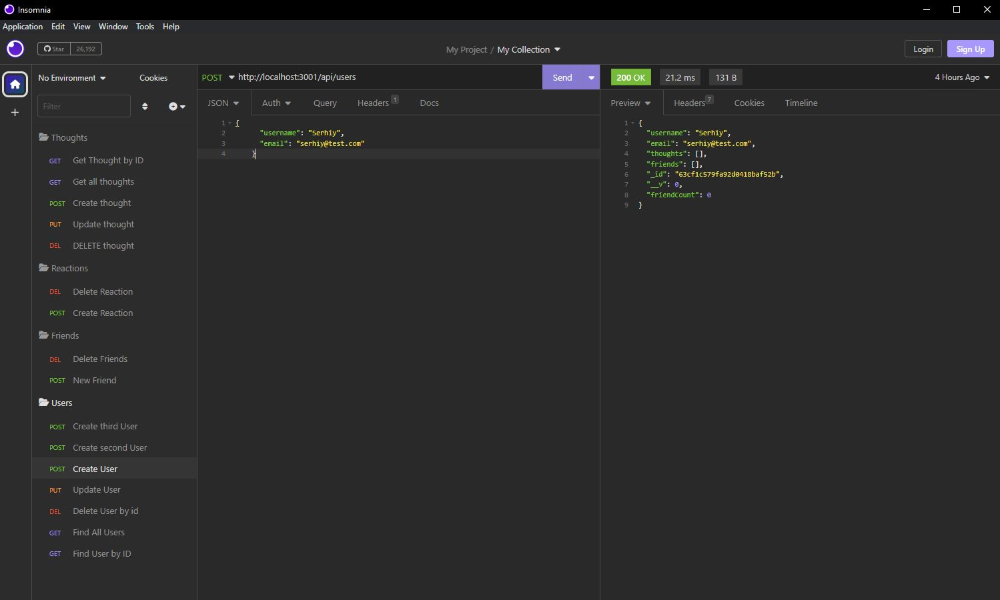
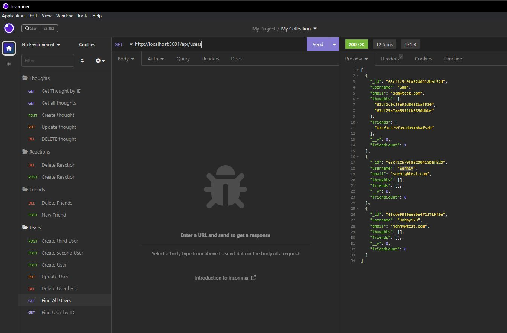
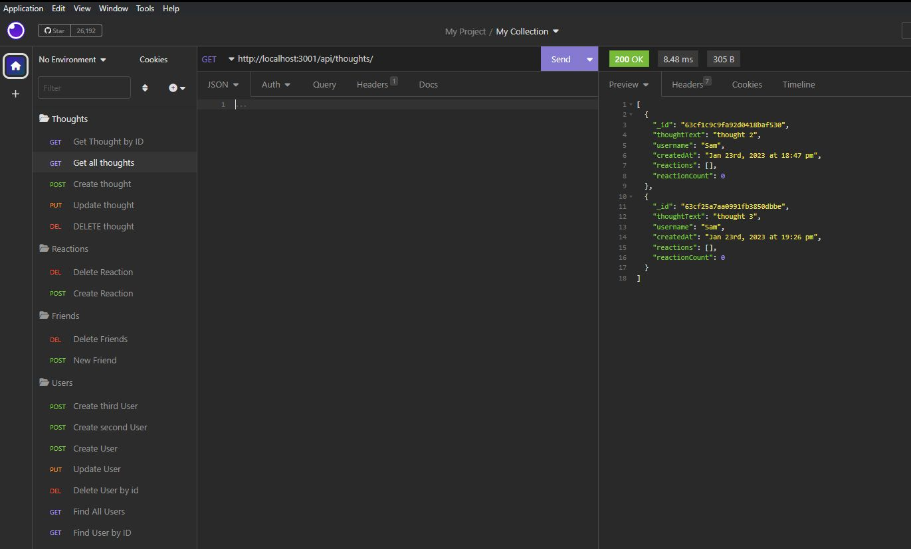

# Social-Network-API


## Description 
This is an APi application for social network web application where users can share their thoughts, react to friends’ thoughts, and create a friend list.
​
This backend application we can use for social media startups. It uses a NoSQL database, Express.js for routing, MongoDB database, and Mongoose ODM to handle large amounts of unstructured data. When the application is invoked, the server is started, and Mongoose models are synced to the MongoDB database.

## Content
​
* [Installation](#installation)
* [Usage](#usage)
* [Packages](#packages)
* [Credits](#credits)
* [License](#license)

## Installation

Clone the repository, navigate to the project folder on your CLI and run the command ```npm install``` to install Node.js.

## Usage

Run the command  ```npm start``` on your CLI to run the application.

[Video demo](https://drive.google.com/file/d/1fmaXURvyU7j9lnmRRZ8neuUEaO9j1vIB/view?usp=sharing)






## Packages

* Express.js https://www.npmjs.com/package/express
* Mongoose ODM https://www.npmjs.com/package/mongoose to connect to MongoDB

## Credits
​
Created by Serhiy Zvedenyuk.
For additional questions and information, please visit is my [GitHub profile](https://github.com/SerhiyZv) or reach out via email at skiev31@gmail.com 

## License

MIT License

Copyright (c) 2023 SerhiyZv

Permission is hereby granted, free of charge, to any person obtaining a copy
of this software and associated documentation files (the "Software"), to deal
in the Software without restriction, including without limitation the rights
to use, copy, modify, merge, publish, distribute, sublicense, and/or sell
copies of the Software, and to permit persons to whom the Software is
furnished to do so, subject to the following conditions:

The above copyright notice and this permission notice shall be included in all
copies or substantial portions of the Software.

THE SOFTWARE IS PROVIDED "AS IS", WITHOUT WARRANTY OF ANY KIND, EXPRESS OR
IMPLIED, INCLUDING BUT NOT LIMITED TO THE WARRANTIES OF MERCHANTABILITY,
FITNESS FOR A PARTICULAR PURPOSE AND NONINFRINGEMENT. IN NO EVENT SHALL THE
AUTHORS OR COPYRIGHT HOLDERS BE LIABLE FOR ANY CLAIM, DAMAGES OR OTHER
LIABILITY, WHETHER IN AN ACTION OF CONTRACT, TORT OR OTHERWISE, ARISING FROM,
OUT OF OR IN CONNECTION WITH THE SOFTWARE OR THE USE OR OTHER DEALINGS IN THE
SOFTWARE.